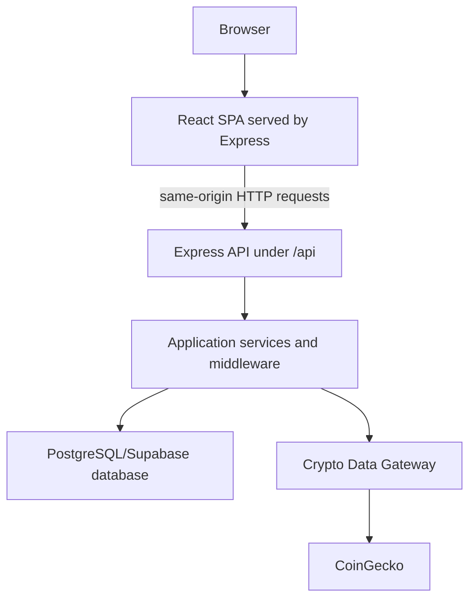

# Architecture

## Overview

MarketMint is a fullstack crypto dashboard organized as a **Yarn workspace monorepo**. The repository separates frontend, backend, shared types, infrastructure files, and documentation so each concern can evolve independently while still sharing common contracts.

The application is deployed as a single Cloud Run service. The Node.js/Express backend exposes the API and also serves the compiled React/Vite frontend as static files. This keeps production deployment simple: one public URL, one Cloud Run service, one origin for browser requests, and no separate frontend hosting provider.

## Workspace Structure

```
challenge-monabit/
├─ apps/
│  ├─ web/          React frontend (Vite + TypeScript)
│  └─ api/          Node.js / Express backend (TypeScript)
├─ packages/
│  └─ shared/       Shared TypeScript types consumed by both apps
├─ infra/           Docker, local infrastructure, and Cloud Run artifacts
└─ docs/            Technical documentation
```

## Main Components

### `apps/web`

React SPA built with Vite and TypeScript. It contains the private dashboard, authentication screens, user management views, crypto explorer, favorites view, profile area, and UI components.

The frontend communicates with the backend through HTTP and does not call external crypto providers directly. All crypto data comes from backend API routes.

### `apps/api`

Node.js/Express backend built with TypeScript. It owns authentication integration, authorization checks, user management, database access, crypto synchronization, API documentation, and static delivery of the compiled frontend.

The backend acts as the only integration point for external services such as CoinGecko, Supabase/PostgreSQL, Better Auth, Google OAuth, Resend, and Cloud Run runtime services.

### `packages/shared`

TypeScript-only package for domain types and shared contracts used by both the frontend and backend. The frontend and backend do not depend on each other directly; both can depend on shared definitions from `@monabit/shared`.

### `infra`

Contains infrastructure-related files such as Docker assets, Docker Compose for local services, and Cloud Run deployment documentation. Secrets are not stored in this directory.

### `docs`

Contains the project documentation requested for the challenge: architecture, data model, environment variables, authentication/security, crypto provider strategy, deployment, AI usage, and limitations.

## Runtime Flow



## Request Routing Model

The Express server handles two types of requests:

1. **API requests** under `/api/*`.
2. **Frontend routes** for all non-API paths.

For API routes, Express returns JSON responses, authentication responses, Swagger documentation, or health check data.

For non-API routes, Express serves the compiled React application. This allows direct navigation and browser refreshes to work correctly in the SPA, because unknown frontend routes fall back to `index.html` and are then resolved by React.

## Key Technical Decisions

### Single Cloud Run Service

The frontend and backend are deployed together in one Cloud Run service. This reduces operational complexity and avoids cross-origin production issues. Since Express serves the frontend build, a separate backend URL is not required.

### SQL Database

MarketMint uses a PostgreSQL-compatible SQL database. Local development can run PostgreSQL through Docker Compose, while production uses Supabase.

The relational model is useful for users, sessions, roles, favorites, audit logs, crypto assets, market snapshots, KPIs, and sync runs.

### Better Auth

Authentication is handled with Better Auth inside the backend. Better Auth manages user identity, credential handling, sessions, Google OAuth, password reset, email verification flows, and admin user-management endpoints.

MarketMint extends the Better Auth user model with application-level fields such as role and ban state.

### Cookie-Based Sessions

The browser app uses cookie-based sessions managed by Better Auth. Session tokens are not stored in `localStorage`.

### Role-Based Access Control

The application distinguishes between regular users and administrators. Admin-only backend routes are protected with role checks, and the frontend exposes administrative screens only to users with the appropriate role.

### Crypto Data Gateway

CoinGecko is the active crypto data provider, but the backend does not couple business logic directly to CoinGecko. Crypto provider access is wrapped behind a gateway interface so another provider can be introduced later with limited changes.

### Local Crypto Catalog

The backend periodically synchronizes up to 250 crypto assets from CoinGecko into the local database. The default sync interval is **5 minutes**, controlled by `CRYPTO_SYNC_INTERVAL_MINUTES`.

The frontend reads dashboard data, search results, favorites, charts, and KPIs from the backend/database, not directly from CoinGecko.

### USD-Only MVP

All monetary values are stored and displayed in USD for the challenge scope.

## Main Feature Areas

### Authentication

- Email/password registration.
- Email/password login.
- Google login through OAuth.
- Logout.
- Password reset flow.
- Email verification flow.
- Private routes.

### User Management

- Administrator user listing.
- User creation.
- Basic user editing.
- Role management.
- User banning/unbanning.
- User deletion.
- Audit logs for user-related administrative actions.

### Crypto Dashboard

- General market KPIs.
- Top 10 cryptocurrencies by market capitalization.
- Current price.
- 24h percentage variation.
- Market cap and volume.
- Daily historical charts based on stored snapshots.
- Last update information.
- 7-day trend sparkline per asset.

### Crypto Explorer and Favorites

- Backend-backed search and filtering.
- Favorite cryptocurrencies per user.
- Favorites view for a personalized watchlist.

### API Documentation and Health

- Swagger documentation for API visibility.
- Health endpoint for runtime validation and Cloud Run checks.

## Related Documents

- [`auth-security.md`](./auth-security.md)
- [`schema.md`](./schema.md)
- [`crypto-data-gateway.md`](./crypto-data-gateway.md)
- [`cloud-run.md`](./cloud-run.md)
- [`environment-variables.md`](./environment-variables.md)
